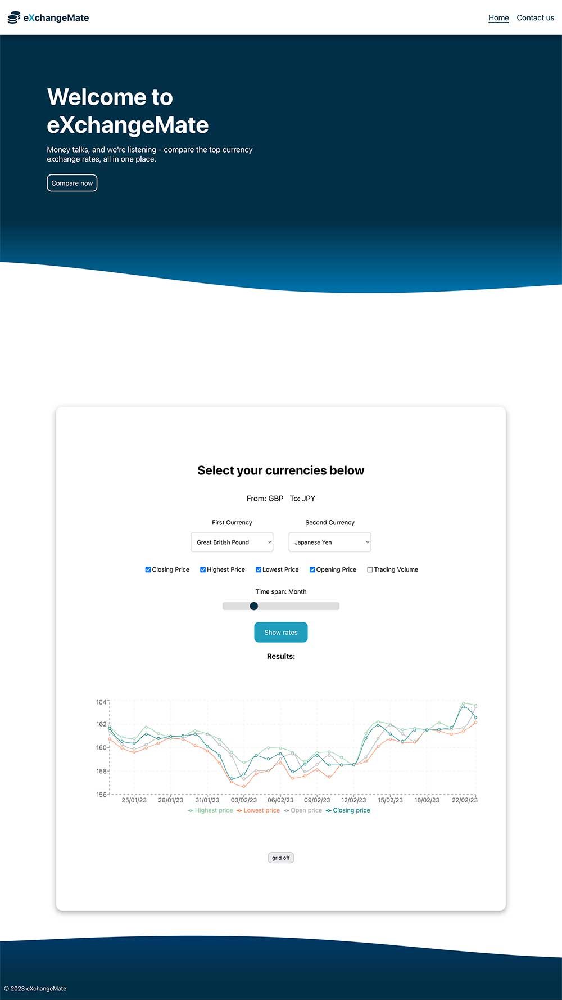

# Project Title: ExchangeMate

## Description

This is an application to assist foreign exchange traders, financial market participants, financial analysts or simply market enthusiasts in decision making or analysis of past foreign exchange market movements.

It integrates 5 variables related to a chosen foreign exchange pair of currencies:

- closing price
- opening price
- the highest price point on the day
- the lowest price on the day
- the trading volume

## Table of Contents
- [Description](#description)
- [Installation](#installation)
- [Usage](#usage)
- [Licence](#licence)
- [Contributing](#contributing)
- [Tests](#tests)
- [Questions](#questions)

## Installation

There are no special installation instructions. Please just go the [URL of the deployed application](https://exchangemate.netlify.app/).

## Screenshot

## Usage

You can use the application on [this link](https://exchangemate.netlify.app/).

Select the pair of currencies from the dropdown boxes in order to obtain the data.

Choose one or more checkboxes corresponding to the variables you wish to render graphical output for.

Choose how far back in time you wish to query using the slide bar.

Finally click the "Show rates" button.

The graphical output will be rendered below.

You can check/uncheck the checkboxes as needed and the graphical output will be updated accordingly.

For ease of reading the graphs, you can show or hide the grid using "Grid on"/"Grid off" button.

## Licence

MIT

## Contributing

If you wish to enhance the application, please use the form in the "Contact us" page.

## Tests

There are no specific testing instructions.

## Questions

For more questions please visit:
[https://github.com/stansaner](https://github.com/stansaner)

or send an email to: stan.saner@hotmail.co.uk

      